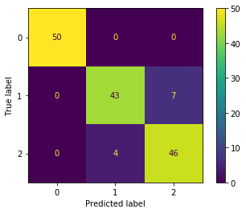

# Custom Metric Example

Let's make a custom metric and use it with cross-validation and `GridSearchCV`

For the sake of simplicity, let's use the iris toy dataset

## Data Preparation


```python
from sklearn.datasets import load_iris
```


```python
data = load_iris()
```


```python
data.target_names
```


    array(['setosa', 'versicolor', 'virginica'], dtype='<U10')


```python
import pandas as pd
```


```python
X = pd.DataFrame(data.data, columns=data.feature_names)
```


```python
X.head()
```


<div>
<style scoped>
    .dataframe tbody tr th:only-of-type {
        vertical-align: middle;
    }

    .dataframe tbody tr th {
        vertical-align: top;
    }

    .dataframe thead th {
        text-align: right;
    }
</style>
<table border="1" class="dataframe">
  <thead>
    <tr style="text-align: right;">
      <th></th>
      <th>sepal length (cm)</th>
      <th>sepal width (cm)</th>
      <th>petal length (cm)</th>
      <th>petal width (cm)</th>
    </tr>
  </thead>
  <tbody>
    <tr>
      <th>0</th>
      <td>5.1</td>
      <td>3.5</td>
      <td>1.4</td>
      <td>0.2</td>
    </tr>
    <tr>
      <th>1</th>
      <td>4.9</td>
      <td>3.0</td>
      <td>1.4</td>
      <td>0.2</td>
    </tr>
    <tr>
      <th>2</th>
      <td>4.7</td>
      <td>3.2</td>
      <td>1.3</td>
      <td>0.2</td>
    </tr>
    <tr>
      <th>3</th>
      <td>4.6</td>
      <td>3.1</td>
      <td>1.5</td>
      <td>0.2</td>
    </tr>
    <tr>
      <th>4</th>
      <td>5.0</td>
      <td>3.6</td>
      <td>1.4</td>
      <td>0.2</td>
    </tr>
  </tbody>
</table>
</div>


```python
y = pd.Series(data.target)
```


```python
y.value_counts()
```


    2    50
    1    50
    0    50
    dtype: int64


### Scaling

For logistic regression to converge, let's scale the data

(I didn't do this in my initial example and it created a lot of red warnings)


```python
from sklearn.preprocessing import StandardScaler
```


```python
scaler = StandardScaler()
```


```python
X = scaler.fit_transform(X)
```

## Initial Modeling with Logistic Regression

We aren't doing a train-test split since this is a tiny dataset and it's difficult enough to get a recall score below 1.0. In any real modeling situation you would want to do a train-test split!


```python
from sklearn.linear_model import LogisticRegression
```


```python
lr = LogisticRegression(random_state=2020, solver="liblinear")
```


```python
lr.fit(X, y)
```


    LogisticRegression(C=1.0, class_weight=None, dual=False, fit_intercept=True,
                       intercept_scaling=1, l1_ratio=None, max_iter=100,
                       multi_class='auto', n_jobs=None, penalty='l2',
                       random_state=2020, solver='liblinear', tol=0.0001, verbose=0,
                       warm_start=False)


## Model Evaluation with Already-Existing Metrics


```python
lr.score(X, y)
```


    0.9266666666666666


```python
from sklearn.metrics import confusion_matrix
```


```python
confusion_matrix(y, lr.predict(X))
```


    array([[50,  0,  0],
           [ 0, 43,  7],
           [ 0,  4, 46]])


```python
from sklearn.metrics import plot_confusion_matrix
```


```python
plot_confusion_matrix(lr, X, y);
```





```python
from sklearn.metrics import recall_score
```


```python
recall_score(y, lr.predict(X), average='micro')
```


    0.9266666666666666


## Model Evaluation with a Custom Metric

Let's say we want the recall score `true_positives / (true_positives + false_negatives)`

### Basic Score Calculation

We could calculate it by hand:


```python
43 / (43 + 7 + 0)
```


    0.86


But a more robust technique would be to reuse the `recall_score` method

First, note that if we set `average=None`, it gives us an array of recall scores, one for each class:


```python
recall_score(y, lr.predict(X), average=None)
```


    array([1.  , 0.86, 0.92])


We can simply take the value at a given index, to get the recall score for that class:


```python
recall_score(y, lr.predict(X), average=None)[1]
```


    0.86


### Cross Validation

We know that a cross-validated score will represent generalization better...how to do that with our custom code?

First, put the above code into a function (with the index hard-coded):


```python
def class_1_recall(y_true, y_pred):
    return recall_score(y_true, y_pred, average=None)[1]
```


```python
class_1_recall(y, lr.predict(X))
```


    0.86


Then use `make_scorer` to pass your custom function into `cross_val_score`

(`make_scorer` takes 3 arguments, and actually calls the `.predict` method on the estimator. In theory we could do this without `make_scorer`, but there would be a higher possibility of making mistakes in our code, so let's just allow `make_scorer` to do the work for us.)


```python
from sklearn.model_selection import cross_val_score
from sklearn.metrics import make_scorer
```


```python
recall_scores = cross_val_score(lr, X, y, scoring=make_scorer(class_1_recall))
recall_scores
```


    array([0.6, 0.9, 0.8, 0.7, 1. ])


```python
sum(recall_scores)/len(recall_scores)
```


    0.8


So, this tells us that our generalized class 1 recall score could be as low as 0.6, as high as 1.0.  The average of our cross-validated scores is a bit worse than the score for the dataset overall

## Grid Search

Ok, rather than just evaluating a given model's performance, let's try using this custom metric in a grid search


```python
param_grid = {
    "penalty": ["l1", "l2"],
    "C": [10.0, 1.0, 0.1]
}
```


```python
from sklearn.model_selection import GridSearchCV
```


```python
grid_lr = LogisticRegression(random_state=2020, solver="liblinear")
grid = GridSearchCV(grid_lr, param_grid, make_scorer(class_1_recall))
```


```python
grid.fit(X, y)
```


    GridSearchCV(cv=None, error_score=nan,
                 estimator=LogisticRegression(C=1.0, class_weight=None, dual=False,
                                              fit_intercept=True,
                                              intercept_scaling=1, l1_ratio=None,
                                              max_iter=100, multi_class='auto',
                                              n_jobs=None, penalty='l2',
                                              random_state=2020, solver='liblinear',
                                              tol=0.0001, verbose=0,
                                              warm_start=False),
                 iid='deprecated', n_jobs=None,
                 param_grid={'C': [10.0, 1.0, 0.1], 'penalty': ['l1', 'l2']},
                 pre_dispatch='2*n_jobs', refit=True, return_train_score=False,
                 scoring=make_scorer(class_1_recall), verbose=0)


```python
grid.best_estimator_
```


    LogisticRegression(C=10.0, class_weight=None, dual=False, fit_intercept=True,
                       intercept_scaling=1, l1_ratio=None, max_iter=100,
                       multi_class='auto', n_jobs=None, penalty='l1',
                       random_state=2020, solver='liblinear', tol=0.0001, verbose=0,
                       warm_start=False)


### Grid Search Evaluation

Comparing the grid's best model's performance to our original model's performance


```python
class_1_recall(y, grid.predict(X))
```


    0.94


```python
class_1_recall(y, lr.predict(X))
```


    0.86


```python
confusion_matrix(y, grid.predict(X))
```


    array([[50,  0,  0],
           [ 0, 47,  3],
           [ 0,  2, 48]])


```python
confusion_matrix(y, lr.predict(X))
```


    array([[50,  0,  0],
           [ 0, 43,  7],
           [ 0,  4, 46]])


## Conclusion

Here we used a toy dataset, the iris dataset, to create an example of a custom recall metric that can be used to:

 - Describe the model's performance on the training dataset (full data or cross-validated)
 - Perform a grid search to find hyperparameters optimized for the custom metric, rather than one of the metrics built in to SciKit-Learn

Note that this example does not follow machine learning best practices; it is designed to demonstrate a custom metric with minimal code snippets


```python

```
